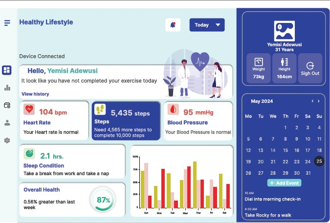

<h1 style="font-size: 35px;">Data Analyst | Business Analyst |    Research Analyst</h1>

<h1 style="font-size: 28px;">SUMMARY</h1>

I am an experienced data professional with a strong background in data analytics, business intelligence, and statistical analysis. Proficient in leveraging data to drive insights, optimize processes, and support decision-making. Skilled in SQL, Python, Power BI, Tableau, PowerPoint, ArcGIS, and cloud technologies. Adept at handling large datasets, developing automated workflows, and delivering data-driven solutions. I am a proactive problem-solver with strong communication and leadership skills, able to collaborate effectively with cross-functional teams. Passionate about utilizing data to generate meaningful business insights and improve organizational performance.

<h1 style="font-size: 28px;">EDUCATION</h1>
---

Big Data Analytics Post-Graduate Certificate

Bachelor of Social Science in Economics

National Diploma in Accountancy

<h1 style="font-size: 28px;">TRAINING & CERTIFICATES</h1>
---
-	Data Analytics Professional Certificate | AWS Cloud Architecting | SAS Programming
- SAS Visual Analytics |	TCPS 2: CORE 2022 |	Standard First Aid – CPR / AED
- SAS Visual Analytics 1 for SAS Viya: Basics (8.5) |	Amazon Aurora MySQL and Amazon RDS MySQL |	Amazon QuickSight Advanced Business Intelligence Authoring (Part 1 & 2)
- Amazon Relational Database Service for MySQL Troubleshooting |	Introduction to Building with AWS Databases	 |	AWS Data Engineering
- AWS Cloud Foundation |	AWS Cloud Developing |	Applied Project Management
- Workplace Hazardous Materials Information System (WHMIS) |	Amazon Aurora MySQL – Basics |	Amazon Aurora PostgreSQL and Amazon RDS PostgreSQL
- Amazon RDS Service Primer |	Amazon Relational Database Service (Amazon RDS) for PostgreSQL – Troubleshooting |	Getting Started with Amazon RDS for MariaDB

<h1 style="font-size: 28px;">WORK EXPERIENCE</h1>
---

### Boots On The Ground (BOTG) | Feb 2024 – Aug 2024 
### Data Analyst & Team Lead		
-	Designed and maintained interactive dashboards and reports using Power BI and SSRS, delivering actionable insights for executive and operational decision-making.
-	Performed advanced SQL queries to extract and analyze data from diverse sources, improving organizational data accessibility and accuracy.
-	Led data validation and transformation efforts for large datasets, ensuring compliance with quality standards and supporting strategic business objectives.
-	Provided consultation and training on key performance indicators (KPIs), data interpretation, and reporting tools to cross-functional teams.
-	Collaborated with project managers to track milestones and performance metrics, enhancing project delivery outcomes.
-	Utilized ArcGIS to perform spatial analysis and geographic data visualization, enhancing location-based insights for strategic decision-making.
-	Integrated GIS data with Power BI dashboards, allowing stakeholders to interactively explore geographic trends and workforce demographics.
-	Streamlined processes by integrating automated solutions for recurring data requests using Microsoft SQL Server Management Studio and data pipeline tools.

### Terragon Group  | Jun 2019 - Sep 2023
### Operational & Business Analyst										
-	Compiled and analyzed healthcare program data using statistical models, improving program evaluation and resource allocation.
-	Maintained clinical and operational reports, ensuring timely updates to support leadership decision-making processes.
-	Developed and maintained user-friendly dashboards to visualize data trends and key metrics for non-technical stakeholders.
-	Partnered with clinical teams to align operational metrics with funding models, optimizing healthcare service delivery.
-	Produced in-depth reports using BI tools like Power BI, aligning organizational strategies with data-driven insights.
-	Delivered training sessions on advanced Excel functions, report writing, and KPI development to internal teams.

<h1 style="font-size: 28px;">PROJECTS</h1>
---
- Seemless Veteran Dashboard

- Figma (Healthy Lifestyle)
  

- ArcGIS Geospartial Analysis (Impact of Covid-19)
  

- 

<h1 style="font-size: 28px;">REFERENCES</h1>
---
## WayPoint Center for Mental Healthcare
### Obinna Emeruwa 
(647) 618-5654
oemeruwa@waypointcentre.ca 

## Boots On The Ground LLC.
### Monto Joseph
(434) 818-7868
monto@botgsolutions.com

## Boots On The Ground LLC.
### Barbara J. Hamilton
781-789-9171
barbara@botgsolutions.com
